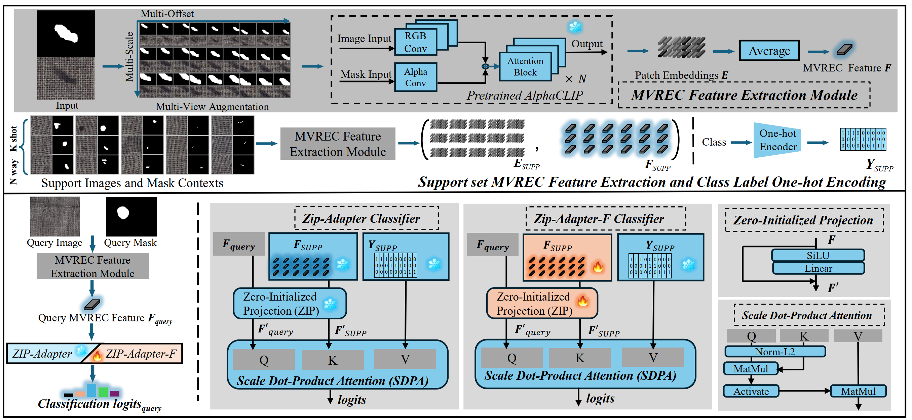

# MVREC: Few-Shot Defect Multi-Classification Framework

This repository contains the implementation of **MVREC**, a general framework for **Few-Shot Defect Multi-Classification (FSDMC)**, as described in our paper accepted to AAAI 2025.

**Paper**: [https://arxiv.org/abs/2412.16897](https://arxiv.org/abs/2412.16897)


## Overview

Few-shot defect multi-classification is a critical problem in industrial quality control. Existing works predominantly focus on anomaly detection (localization), while MVREC is the first general few-shot defect classification framework based on the CLIP paradigm. MVREC addresses these challenges with the following innovations:

1. **General Features Extraction**: Leveraging the pre-trained AlphaCLIP model for defect instance feature extraction.
2. **Region-Context Enhancement**: A novel framework combining mask region input and multi-view context augmentation to refine defect features.
3. **Few-shot Zip-Adapter(-F) Classifiers**: Efficiently cache visual features of the support set to enable few-shot classification.
4. **New Benchmark**: Introduction of **MVTec-FS**, a few-shot defect dataset derived from MVTec AD, featuring 1228 images, 46 defect types, and instance-level mask annotations.



### Features

- **Few-shot Support**: Supports few-shot learning with k-shot configuration.
- **Multi-View Contextual Learning**: Incorporates multi-view augmentation to boost classification performance.
- **Customizable**: Configurable for different datasets and training scenarios.

## MVTec-FS Dataset

The MVTec-FS dataset is based on MVTec AD and includes:
- 1228 defect images
- 46 defect types
- Instance-level mask annotations

For more details on MVTec-FS, refer to the paper.

---
### Download Dataset

You can download the MVTec-FS dataset from [MVTec-FS GitHub repository](https://github.com/ShuaiLYU/MVTec-FS). Once downloaded, update the `data_param.py` file to set the correct local paths to the dataset.

For more details on MVTec-FS, refer to the paper.

---
## Getting Started
### Prerequisites

Install the dependencies:
```bash
pip install -r requirements.txt
```

### Repository Structure

- `data_param.py`: Contains dataset configurations for MVTec-FS and other datasets.
- `fewshot_process.py`: Functions for generating few-shot support/query datasets and evaluation processes.
- `param_space.py`: Parameter configurations for experiments.
- `run.py`: Main entry point for training and evaluation.
- `run.sh`: Script for running experiments with different configurations.

---

## Usage

### Training and Evaluation

Run the framework with:
```bash
python run.py --data_option mvtec_bottle_data \
              --ClipModel.classifier EchoClassfierF \
              --ClipModel.backbone_name ViT-L/14 \
              --ClipModel.clip_name AlphaClip \
              --debug.k_shot 5 \
              --data.input_shape 224 \
              --data.mv_method mso \
              --debug.acti_beta 1 \
              --exp_name experiment_name \
              --run_name run_name
```

Alternatively, use the provided shell script:
```bash
bash run.sh
```

### Configurations

- **Datasets**: Defined in `data_param.py`. Examples include `mvtec_carpet_data`, `mvtec_bottle_data`, etc.
- **Parameters**: Adjust parameters in `param_space.py` for different experiment settings.


---

## Citation

If you use this repository or the MVTec-FS dataset, please cite our work:


```bibtex
Lyu S, Zhang R, Ma Z, et al. MVREC: A General Few-shot Defect Classification Model Using Multi-View Region-Context[C]//Proceedings of the AAAI Conference on Artificial Intelligence. 2025, 39(6): 5937-5945.
```

---

## License

This project is licensed under the MIT License.

---

## Acknowledgements

We thank the contributors to the MVTec AD dataset and the creators of AlphaCLIP.
